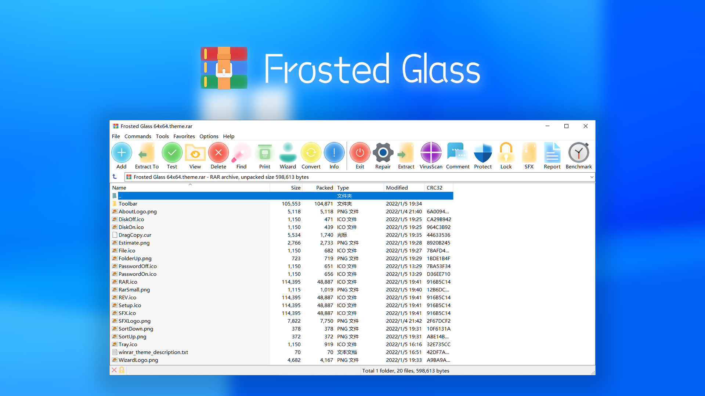

 
 <h2 align="center">Frosted Glass</h2>
 
Frosted Glass Style Theme of WinRAR

  
  
  
  

  <a href="README.zh-CN.md">简体中文</a> | <a href="README.md">English</a>

## 1. 毛玻璃风格

这是一款适用于 WinRAR 的主题，它根据 Windows 11 的图标风格进行设计，并且进行了毛玻璃化，使整个图标看起来更加的通透和明亮。

## 2. 前提

此主题需要您的 WinRAR 版本为 **5.60+** 

## 3. 下载

共有 48x 和 64x 两种尺寸，可在 [release](https://github.com/bitcookies/frosted-glass-winrar-theme/releases) 页面获取：

+ Frosted Glass 48x48.theme.rar
+ Frosted Glass 64x64.theme.rar

建议 1080p 以下显示器使用 48x 尺寸，高于 1080p 的显示器使用 64x 尺寸。

## 4. 截图

## 5. 建议

如果你对此主题有任何建议，可以在 [Issues](https://github.com/bitcookies/winrar-keygen/issues) 提出 😄

## 6. 许可

使用 [GPL License](https://github.com/bitcookies/frosted-glass-winrar-theme/blob/master/LICENSE)
